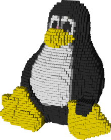

# LegoLand (2011)
 Building 3D Models using LEGO bricks
 
 
Everyone likes playing with LEGO. However, not everyone is satisfied with building the standard scenes, and many would welcome the possibility to create custom scenes themselves, using a new technique for converting 3D models into Lego scenes.

 

Using our program, it is possible to choose any 3D mesh model (which can be found on the net, built in modeling programs or scanned using a 3D scanner) and easily build it with LEGO bricks using detailed step-by-step instructions.

 

Our program focuses on model stability as well as appearance, and generates LEGO models from 3D mesh models automatically, with minimum user interaction.

 

The program is implemented in C++, using OSG standard library for visualization. In addition, the program outputs a LEGO model in LDraw format, which is compatible with numerous LEGO CAD programs, such as MLCad.
 
 
 

 
 
 Video demonstration:
 https://www.youtube.com/watch?v=-zVaEPEFbcw&ab_channel=FUNanna1000
 
 More info and examples on the project web site:
 https://cgm.technion.ac.il/Computer-Graphics-Multimedia/Undergraduate-Projects/2010/3DModel2Lego/ProjectWeb/index.htm
 
